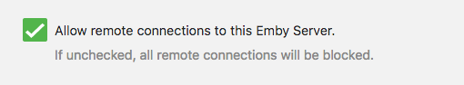

# How to use

1) Clone repo or download zip file
2) Rename or copy all of the files in the `env` folder to remove the `.save` from the filenames
3) Populate all of the files in the `env` folder with your information
4) Make sure you change the volumes for Emby and Nextcloud to suite your needs.

# MAKE SURE YOU SET EMBY TO ALLOW REMOTE CONNECTIONS
### Admin -> Advanced

## TODO
* Separate volume mounts so they're not hard coded in the compose file

